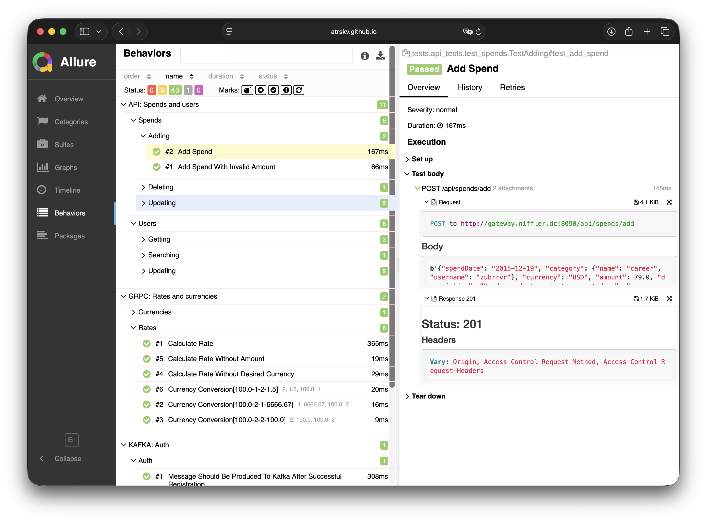
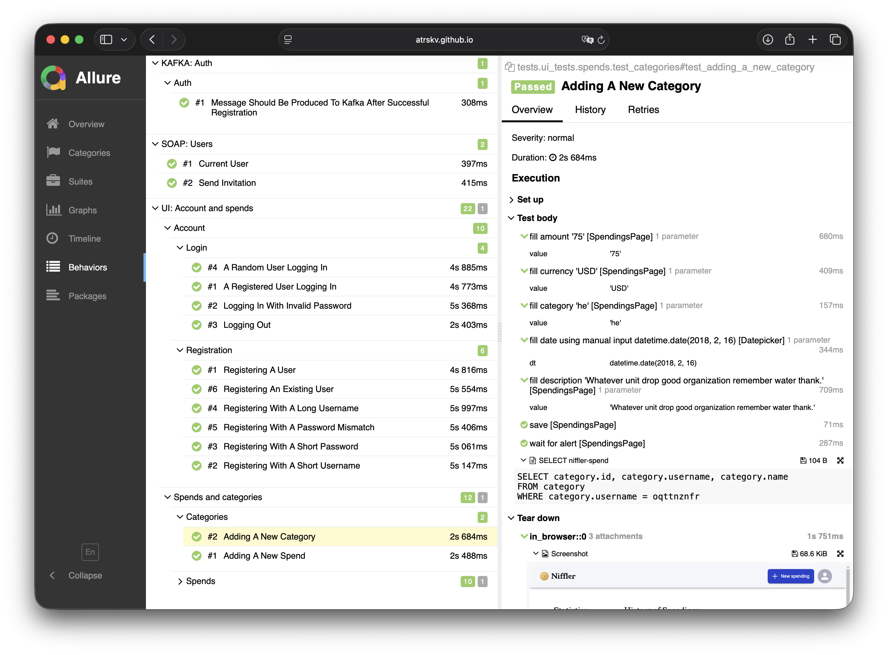

<h1 align="center">
  Niffler tests
</h1>

<p align="center">
Тест-кейсы для веб-приложения по учету трат
</p>


UI-сценарии автоматизированы через Selene, REST API — с requests. Также реализованы тест-кейсы для gRPC, Kafka и SOAP. Отчёты формируются в Allure






## Запуск

1. Склонировать репозиторий продукта:

```
git clone https://github.com/atrskv/niffler.git
```
2. Перейти к проекту с тест-кейсами:

```
cd niffler_tests
```

3. Установить зависимости:

```
poetry install
```

4. Открыть проект в PyCharm, настроить интерпретатор

5. Заполнить `config.*.env`, при необходимости изменить значения у параметров

6. Запустить тест-кейсы, исходя из выбранного контекста:

```
context='local' pytest tests
```

```
context='remote' pytest tests
```

Можно запустить параллельно, например:

```
context='local' pytest -n auto tests 
```


7. Cгенерировать отчёт:

```
allure serve allure-results
```


## Github Actions

При `push` и `pull request` к `main` запускается пайплайн со всеми тест-кейсами `-n auto`. С итоговым отчетом можно ознакомиться [здесь](https://atrskv.github.io/niffler/#behaviors) 

